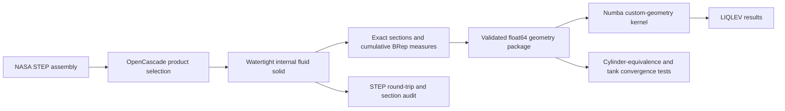

# LIQLEV Arbitrary Tank Geometry Design

**Date:** 2026-07-23  
**Status:** Approved  
**Repository:** `C:\Users\sasorian\Documents\Eta_Space\LIQLEV-Geometry-Kernel`  
**Height and gravity axis:** assembly `+Y`

## 1. Purpose

Extend the JIT-compiled LIQLEV core so it can solve tanks whose internal
geometry is not a constant-diameter cylinder. The first application is the
NASA tank assembly:

`C:\Users\sasorian\Documents\Eta_Space\geometry\nhq01-m21a- 0201_TankAssy_NASA.STEP`

The implementation will preserve the legacy analytic cylinder path and add a
custom-geometry path driven only by numeric arrays inside Numba. OpenCascade
will be used only in an offline preprocessing step.

The CAD deliverable will be one watertight, baffle-free internal fluid-volume
solid. Its two large axial ports will be capped at the wet-side closure planes.

## 2. Source Authorities and Provenance

### 2.1 CAD source

- File: `nhq01-m21a- 0201_TankAssy_NASA.STEP`
- Size: `36,844,537` bytes
- SHA-256:
  `0193EC296B5B754FFDC7B1652052F5B28BA99345A5BC89922D026DF011C837D5`
- STEP application protocol: AP214
- Source authoring application: SolidWorks 2023

The source assembly is read-only. It will not be modified or committed to the
new repository. Generated artifacts will carry the source hash in their
metadata so they remain traceable to this exact assembly.

### 2.2 LIQLEV source

The current JIT implementation authority is:

`C:\Users\sasorian\Documents\Cryo Vent LLR\LIQLEV_current_build_team_share_2026-05-13\github_repo_source\core.py`

The new repository will receive an intentional source import rather than
sharing or editing files in place. The imported baseline will be committed
before geometry changes so the new history clearly separates the preserved
solver from the arbitrary-geometry capability.

### 2.3 Physics reference

The governing heritage reference is NASA report NTRS 19700017832, especially
the boundary-layer development in section 4.3 and equations 4-25, 4-33,
4-36, 4-37, and 4-38:

`https://ntrs.nasa.gov/api/citations/19700017832/downloads/19700017832.pdf`

## 3. Examined Geometry

The complete assembly contains 101 products, 393 component instances, 446
placed solids, and 22,476 faces. The tank vessel body is the product
`nhq01-m21a- 0202_short`, placed solid 375 in the resolved assembly.

Tank-body observations:

- Bounding box in assembly coordinates, millimetres:
  - `X: -280.940000 to +280.940000`
  - `Y: -293.966791 to +293.966791`
  - `Z: +296.542759 to +858.422760`
- Material volume: `1,743,803.380 mm^3`
- Surface area: `2,089,586.791 mm^2`
- Faces: 342
- The tank body is open at two opposing ports along `Y`.
- Internal PMD, baffles, spray hardware, and fasteners are separate assembly
  solids and do not need to be Boolean-subtracted from the fluid domain.

The fluid-domain closure planes are the tank body's inner wet-side planar rim
faces:

- Minimum-`Y` closure plane: `Y = -275.406791 mm`
- Maximum-`Y` closure plane: `Y = +275.296791 mm`

These planes deliberately exclude the exterior viewport barrels and closure
hardware.

## 4. Coordinate and Unit Contract

The cleaned STEP will preserve the source assembly coordinate system. The
solver-facing height coordinate is:

`h = Y - Y_min`

where `Y_min = -275.406791 mm`. Therefore:

- `h = 0` is the minimum-`Y` closure plane.
- Height increases in the assembly `+Y` direction.
- The nominal gravity vector for the supported orientation is `-Y`.

CAD preprocessing and audit data use millimetres. Solver arrays are converted
once during export to the existing LIQLEV engineering-unit convention:

- length: feet
- area: square feet
- volume: cubic feet

Every exported table contains an explicit unit declaration. The JIT kernel
performs no hidden unit conversion.

## 5. Clean Fluid-Domain CAD

### 5.1 Required construction

The CAD preprocessor will:

1. Load the assembly with STEP product structure and placements.
2. Select only product `nhq01-m21a- 0202_short`.
3. Identify the inner wet-surface face network connected to the two wet-side
   port loops.
4. Exclude the tank's outer material surface and all separate internal or
   external assembly components.
5. Create planar cap faces from the inner port loops at the two specified
   `Y` planes.
6. Sew the preserved inner faces and two caps into one closed shell.
7. create one positive-volume solid whose interior is the usable fluid domain.
8. Heal only gaps within the STEP model's native tolerance; no smoothing,
   refitting, or contour simplification is allowed.

The primary deliverable is:

`geometry/output/nhq01-m21a-0201_LIQLEV_FLUID_DOMAIN.step`

### 5.2 CAD acceptance criteria

The exported and re-imported STEP must satisfy all of the following:

- exactly one solid;
- exactly one closed outer shell;
- positive volume;
- no internal baffle, PMD, spray-bar, fastener, or viewport-hardware bodies;
- cap planes within `1e-5 mm` of the specified `Y` coordinates;
- bounding box contained within the source tank body's bounding box;
- BRep validity check passes before and after STEP round trip;
- round-trip volume change is no greater than `1e-8` relative or
  `1e-3 mm^3` absolute, whichever is larger;
- round-trip bounding-box coordinate change is no greater than `1e-5 mm`.

The preprocessor will also save a machine-readable audit report and orthogonal
section images inside the repository. Failure of any acceptance criterion
prevents publication of the STEP as a valid output.

## 6. Geometry Kernel

### 6.1 Offline OpenCascade stage

At adaptively selected `h` nodes, the preprocessor will derive:

- `A(h)`: horizontal liquid-vapour interface area;
- `V(h)`: cumulative fluid volume below height `h`;
- `P(h)`: total contact-line perimeter at height `h`;
- `A_w,side(h)`: cumulative wetted inner-wall area below `h`, excluding both
  modeling cap faces;
- `A_w,total(h)`: cumulative wetted boundary area below `h`, including the
  minimum-`Y` cap and including the maximum-`Y` cap only at the full-tank
  endpoint.

The two cap faces exist to close the computational volume. Phase-one LIQLEV
heat-transfer and boundary-layer calculations use `A_w,side`, because the
thermal properties of the omitted closure hardware are not represented by
the cleaned tank shell. `A_w,total` is retained for audit and for a future
explicit closure-surface model.

`V(h)` is computed from an exact BRep half-space intersection. `A(h)` and
`P(h)` are computed from the exact planar section. Wetted areas are computed
from exact BRep faces clipped below the section plane. Triangulation may be
used for visualization but is not an authority for solver tables.

### 6.2 Numeric package

The geometry package will contain contiguous `float64` arrays and interpolation
coefficients:

- strictly increasing height nodes;
- cumulative volume nodes and monotone cubic coefficients;
- section-area samples used to validate `dV/dh`;
- contact-perimeter nodes and non-negative interpolation coefficients;
- cumulative sidewall-area nodes and monotone cubic coefficients;
- cumulative total-wetted-area nodes for audit;
- source and output hashes, units, axis convention, closure planes, table
  tolerances, and CAD audit results.

Binary solver data will be stored as an `.npz` file. The same metadata and
sampled curves will also be stored as JSON and CSV for human inspection.

The authoritative runtime area is the derivative of the monotone cumulative
volume interpolant. This makes level kinematics and volume conservation
internally consistent. Direct CAD section-area samples are an independent
quality check rather than a competing runtime definition.

### 6.3 Table construction and validation

Adaptive refinement begins with all topology-change heights and a uniform
height grid. Intervals are subdivided until both cumulative-volume and
sidewall-area interpolation errors meet the export tolerance.

The package is rejected unless:

- every array is finite and uses the declared units;
- height is strictly increasing;
- cumulative volume and cumulative wall areas are non-decreasing;
- `A(h)` and `P(h)` are non-negative;
- `V(0) = 0` within numerical tolerance;
- final tabulated volume matches the validated CAD solid within `0.05%`;
- integrated runtime area matches final volume within `0.05%`;
- direct CAD section area and `dV/dh` agree within `0.2%` away from topology
  changes;
- refinement from 513 to 1025 evaluation points changes final integrated
  volume and sidewall area by less than `0.05%`.

The phase-one tank domain must have one connected fluid region and one outer
section loop at every interior sample height. A disconnected section or an
internal hole is treated as unsupported geometry and causes a clear
preprocessing error instead of silently combining regions.

## 7. JIT Solver Integration

### 7.1 Preserved legacy mode

The current analytic cylinder path remains available and unchanged. It retains:

- constant cross-sectional area `pi * D^2 / 4`;
- constant perimeter `pi * D`;
- the existing analytic boundary-layer series;
- the existing constant-area liquid-level update.

Existing cylinder regressions must continue to pass before the new mode is
accepted.

### 7.2 Custom-geometry mode

The Numba kernel will receive primitive scalars plus contiguous numeric arrays.
It will not receive Python objects and will never import or call OpenCascade.

The custom path replaces the cylinder assumptions as follows:

| Existing cylinder expression | Custom-geometry expression |
| --- | --- |
| `A_c = pi*D^2/4` | `A(h) = dV/dh` from the volume interpolant |
| `V_l = A_c*h` | `V_l = V(h)` |
| `dh = dV/A_c` | update liquid volume, then solve `V(h) = V_l` |
| `A_w = pi*D*h` | `A_w = A_w,side(h)` |
| `P = pi*D` | `P = P(h)` |
| `epsilon = A_w/(A_w+A_c)` | `epsilon = A_w,side(h)/(A_w,side(h)+A(h))` |
| diameter-based boundary layer | numerical perimeter-aware flux balance |

The inverse `V -> h` uses an interval search followed by a safeguarded solve
inside the interval's monotone cubic. Values below zero or above total volume
produce a bounded, explicit solver error; they are not extrapolated.

### 7.3 Boundary-layer generalization

The heritage cylinder terms imply the perimeter form:

`V_BL(h) = integral_0^h P(s) * delta(s) ds`

and the local exit-flow approximation:

`Q_exit(h) = (2/3) * AK1 * P(h) * delta(h)^(3/2)`

because `(2*pi/3) * AK1 * D` is the unrounded form of the existing
`2.1 * AK1 * D` coefficient.

The custom-geometry boundary-layer state is obtained from the finite-volume
balance:

`d/dh[(2/3) * P(h) * delta(h)^(3/2)] =
    AK3 * [A(h) - P(h)*delta(h)]`

This equation reduces to the heritage constant-diameter form when `A` and `P`
are constant. It is integrated over geometry intervals with non-negative,
safeguarded states. The solver computes `V_BL` with the same interval
quadrature. It never substitutes an equivalent diameter for the actual
section geometry.

The existing coefficient `2.1` remains untouched in legacy mode. Custom mode
uses the explicit `2/3` perimeter form so the generalization is traceable to
the report equations rather than to the rounded cylinder coefficient.

## 8. Data Flow

CAD generation and table extraction are deterministic command-line operations.
Their reports include input arguments, source hashes, output hashes, tool
versions, units, and pass/fail results.

## 9. Errors and Diagnostics

Preprocessing stops with a descriptive failure for:

- missing or changed source STEP;
- ambiguous tank product selection;
- missing or multiply resolved port loops;
- cap planes that do not coincide with the selected wet-side rims;
- a shell that cannot be sewn without exceeding native tolerance;
- more than one resulting solid or cavity;
- disconnected or multiply looped phase-one sections;
- non-monotone or inconsistent geometry tables;
- failed STEP round-trip criteria.

Runtime loading stops before JIT execution for incorrect dtype, non-contiguous
arrays, unit mismatch, inconsistent lengths, non-finite values, or a geometry
hash mismatch. The compiled solver returns an explicit status code for a
liquid volume outside the tabulated domain or for failure of the safeguarded
boundary-layer integration.

## 10. Verification Strategy

### 10.1 Geometry tests

- Unit tests for plane identification, face-network selection, capping,
  sewing, and one-solid validation.
- Analytic cylinder and sphere fixtures with exact expected `A`, `V`, `P`,
  and wetted-area functions.
- Source-tank STEP round-trip checks from section 5.2.
- Independent recomputation of total volume from the exported table.
- Visual section audit at both cap planes, extrema, equator, and every
  topology-change height.

### 10.2 Solver tests

- Preserve all existing legacy-cylinder results.
- Feed an analytic cylinder through the custom numeric path.
- Require custom-cylinder height, interface area, wetted side area,
  boundary-layer volume, and exit-flow terms to agree with the analytic
  cylinder path within `0.1%` across the supported fill range.
- Verify volume conservation for fill, drain, vent, and pressure-driven
  transients.
- Verify exact endpoint handling for empty and full table bounds.
- Confirm Numba compiles the custom kernel in nopython mode with no object
  fallback.
- Record cold compile time and warmed runtime for both modes; the warmed
  benchmark uses identical time-step histories and reports the custom-to-
  legacy cost ratio.

### 10.3 Tank acceptance run

The tank is accepted for development use when:

- all CAD and geometry-table criteria pass;
- the custom-cylinder equivalence test passes;
- tank results are invariant within `0.2%` for height and boundary-layer
  volume when the geometry table is refined from 513 to 1025 evaluation
  points;
- no solver value is NaN, infinite, or outside its physical bounds;
- a result manifest ties the run to the exact STEP and geometry-package
  hashes.

These are numerical consistency criteria, not experimental validation of the
LIQLEV physics for this vessel. Experimental or higher-fidelity correlation is
outside phase one.

## 11. Repository and History

All generated source, reports, tests, and CAD outputs will remain under:

`C:\Users\sasorian\Documents\Eta_Space\LIQLEV-Geometry-Kernel`

The repository uses a new `main` history. Planned history boundaries are:

1. approved design specification;
2. imported JIT solver baseline with preserved tests;
3. CAD extraction and fluid-domain validation;
4. geometry-table package and analytic fixtures;
5. custom Numba solver path and regression results;
6. validated tank artifacts and user documentation.

Commits use the configured user identity. No automated assistant is included
as an author, co-author, or attribution.

## 12. Deliverables

The completed phase-one project will contain:

- the validated baffle-free internal fluid-domain STEP;
- CAD construction and audit tooling;
- exact geometry table extraction and its `.npz`, JSON, and CSV outputs;
- a preserved analytic cylinder mode;
- a Numba-compatible arbitrary-geometry mode;
- analytic cylinder/sphere fixtures and tank convergence tests;
- source-to-output provenance and numerical audit reports;
- operating documentation for regenerating the artifacts and using the new
  LIQLEV geometry mode.

The source NASA assembly remains outside version control and unchanged.
